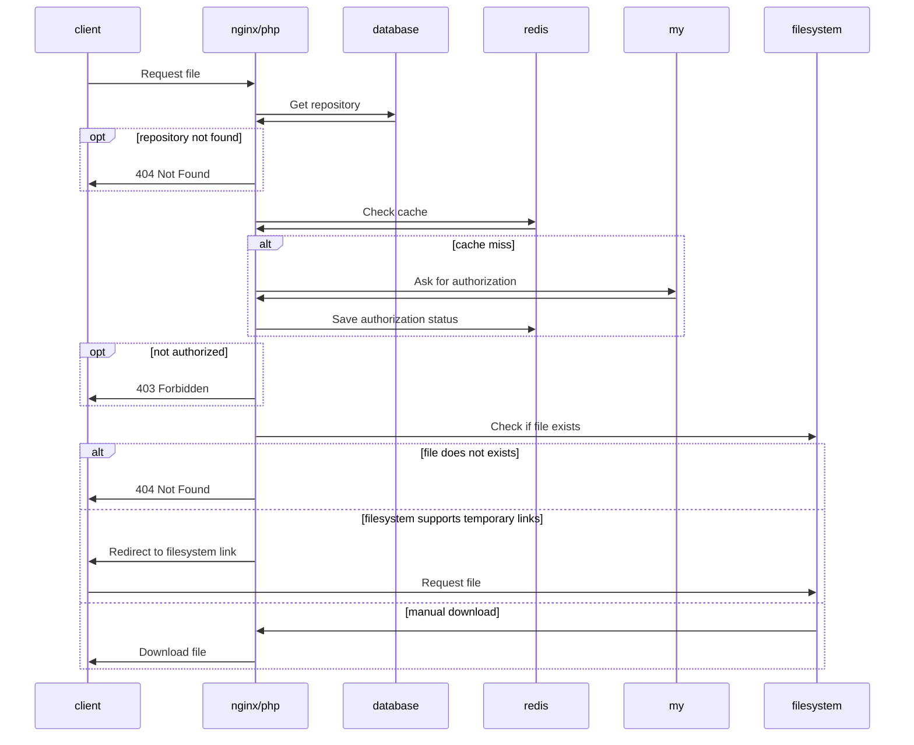
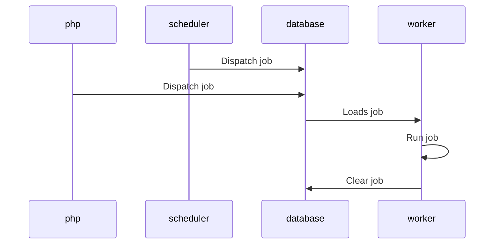

# Space Delivery

Repo management for Nethsecurity installations.

Something went wrong with some packages? Go straight to
the [faulty packages section](#list-of-behaviors-when-faulty-packages-get-accidentally-distributed). :rocket:

## Application Structure

The application is structured as follows:

- `nginx`: Nginx frontend that handles the http requests and proxies them to the php application.
- `php`: Main application that handles the logic and dispatches the jobs.
- `scheduler`: Scheduler that handles cron jobs for the php application.
- `worker`: Worker that handles the jobs dispatched by the php application.
- `redis`: Redis instance for cache.
- `nightwatch-agent`: Agent for nightwatch stats.

The storage can be configured to use different disks, however, a local shared storage is mandatory due to the `sqlite`
database that `php`, `scheduler` and `worker` containers share.

## Renovate Configuration

Renovate is configured to run and auto-merge minor release of the software in this repo. A lockfile maintenance is being made once a month. Security PRs are opened and closed by Renovate and they ignore every scheduling provided.

## Application Behavior

Base file request:



Job dispatch sequence:



## Development Setup

### Prerequisites

- [Docker](https://docs.docker.com/engine/)
- [Docker Compose](https://docs.docker.com/compose/)

`Podman` and `Podman Compose` can be used as an alternative to Docker and Docker Compose, however no deep testing has
been done with these tools.

### Environment

Copy the `.env.example` file to `.env` and edit the entries as needed.

Most of the environment variables are self-explanatory, and there's no need to change their defaults unless explicitly
told so.
However, there are a few that you might want to change:

- `APP_TIMEZONE`: The timezone to use for the app. Even if the container inherits the host's timezone, it's recommended
  to set this value to avoid any issues.
- `FILESYSTEM_DISK`: Disk to use for I/O ops (cloning repositories and snapshots), defaults to `local` (storage/app
  directory). If you want to use a different disk, you need to set the corresponding values for the disk you want to
  use.

  For example, you can directly connect to a DO Space by filling up the AWS_* values with the corresponding values from
  the DO Space.

  ```env
    FILESYSTEM_DISK=s3
    AWS_ACCESS_KEY_ID=your_access_key
    AWS_SECRET_ACCESS_KEY=your_secret_key
    AWS_DEFAULT_REGION=region of the bucket
    AWS_BUCKET=name of the bucket
    AWS_ENDPOINT=https://<region of the bucket>.digitaloceanspaces.com
  ```

  Additional docs can be found in [Laravel Documentation](https://laravel.com/docs/11.x/filesystem).
- `UID`: The user ID for the development environment, set this before running any other command, if this value changes
  you will need to run the command under [Build images](#build-images) again.
- `GID`: The group ID for the development environment, set this before running any other command, if this value changes
  you will need to run the command under [Build images](#build-images) again.

### Build images

To build the development images, you just run the following command:

```bash
docker compose build
```

### Setup development environment

Now we just miss a few steps that will need to be run **only once**:

```bash
docker compose run --rm php php artisan key:generate
```

### Running the development server

You're almost there! Run the following command to start up all the needed services:

```bash
docker compose up
```

You can find the app running at `http://localhost:8080`.

### Running commands

To run any commands inside the development environment, you need to get to the shell using:

```bash
docker compose exec app bash
```

### Running tests

Software is being tested using PestPHP. To run the tests, you can use the provided command inside the development
environment:

```bash
php artisan test
```

## Build

### Prerequisites

- [Docker Bake](https://docs.docker.com/build/bake/)

### Build the production image

GitHub Actions takes care of the deployment of the images to the registry, however if you want to build the production
image yourself, follow the instructions below.

```bash
docker buildx bake -f docker-bake.hcl production
```

You will find the images tagged as `ghcr.io/nethserver/parceler-*:latest`.

## Production

The same services used for development are used for production, it's advised to use a reverse proxy to handle the SSL
termination and load balancing.

### Parceler Configuration

The parceler service is being configured through an environment file, you can find the example in `.env.prod.example`.
While most values are self-explanatory, there are a few that you need to manually set:

- `APP_KEY`: The application key, you can generate one using the development environment
  using `php artisan key:generate --show`.
- `APP_URL`: The full URL where the application is reached from, while most of the functionalities will work with a
  wrong value, the url generation is based off this value.
- `FILESYSTEM_DISK`: Disk to use during production, works same as development, more info in the development setup.
- `REPOSITORY_MILESTONE_TOKEN`: Token used to trigger from remote the milestone creation, you can set this to a random
  value, it's used to avoid unwanted requests.
- `NIGHTWATCH_TOKEN`: In case you want to enable nightwatch stats, you need to set this to the token provided by
  nightwatch.

### Container Configuration

Now that parceler is out the way, there's additional configuration needed for the containers to run properly, here's
container-specific configuration:

`nginx` needs variables to wait for the `php` container to be ready before starting, you can set the following:

- `FPM_HOST`: The host where the php-fpm service is running
- `FPM_PORT`: The port where the php-fpm service is running

`worker` and `scheduler` need the variables to wait for the `php` container to be ready (and hence prepped the
environment):

- `PHP_HOST`: The host where the php-fpm service is running
- `PHP_PORT`: The port where the php-fpm service is running

### Persistent data

There's a sqlite database being stored in the `/var/www/html/storage` (for `php`, `worker` and `scheduler` containers)
directory when running the service, you need to make sure that this directory is persistent across restarts,
otherwise you will lose reference to endpoints and snapshots (or files, if you're using the local disk).

### First deploy

An example of a deployment can be found under the `deploy` directory, you can use the `deploy/docker-compose.yml` file
to deploy the full stack. And replicate the same structure in your server.

### Additional Configuration

If you're using `rclone` to sync the repositories, you can add the configuration file to the container by adding
additional environment variables, documentation can be
found [in the documentation](https://rclone.org/docs/#config-file).

## Usage

### Maintenance mode

To avoid any issues with the files served by the service, if you are operating with the files, you can put the service
in maintenance mode. This will prevent any new requests from being processed and will return a 503 status code. Be aware
that even cron jobs and queues will stop working; to force queues, you can [resort to this command](https://laravel.com/docs/11.x/queues#maintenance-mode-queues).
To enable maintenance mode, you can use the following command:

```bash
php artisan down
```

To disable the maintenance mode, you can use the following command:

```bash
php artisan up
```

Additional configuration can be provided to the application, such as automatic redirects or have a token that allows the
access. Additional configuration can be found
in [documentation](https://laravel.com/docs/11.x/configuration#maintenance-mode).

### Adding a repository

To add a repository, you need to enter to the `php` container and run the following command:

```bash
php artisan repository:create
```

The command will guide you through the process of adding a repository; here are the fields that will be asked:

- `name`: name of the repository will be used to identify the repository under the
  path `repositories/{community|enterprise}/{repository_name}`,
- `command`: the command the worker will run to sync the repository it can be anything available in the container.
  Save the content of the repository under the path `source/{repository_name}` in the disk you're using.
  (e.g. if you're using the local disk, save the content of the repository
  under `storage/app/source/{repository_name}`). `rclone` binary is available in the container, to add a configuration
  file follow the [Additional Configuration](#additional-configuration) section.
- `source_folder`: if repository files are stored in a subfolder, you can specify it here, otherwise leave it empty.
- `delay`: how many days the upstream files are delayed.

Once the repository is added, a sync job will be created and the worker will start syncing the repository.

### List repositories

To list all the repositories, you can use the `php artisan repository:list` command.

```bash
php artisan repository:list
```

### Repo Sync

Repository syncs are dispatched by the scheduler daily. If you want to manually sync a repository, you can use the
`php artisan repository:sync {repository_name}` command.

```bash
php artisan repository:sync {repository_name}
```

### Freezing repositories

Freezing a repository will prevent the system to use the normal defer release using the snapshots. This won't halt
syncs, so you can freeze the repository to avoid a faulty package, you then unfreeze it to skip faulty packages.
To freeze a repository, you can use the `php artisan repository:freeze {repository_name}` command.

```bash
php artisan repository:freeze {repository_name}
```

Advanced usage can be achieved by providing a custom path like so:

```bash
php artisan repository:freeze {repository_name} {path}
```

Please remember:

- The path is relative to the storage disk.
- The path won't be validated, so make sure it's correct.

### Unfreezing repositories

To unfreeze a repository, you can use the `php artisan repository:unfreeze {repository_name}` command.

```bash
php artisan repository:unfreeze {repository_name}
```

### Force release of snapshots

The system will automatically use the oldest snapshot available inside the `delay` timer given for each repo. However,
if you need to push forward the release of some packages you can just delete the older snapshots through the filesystem
used. The system will automatically adapt to the new oldest snapshot available.

### Listing files in a repository

Since there's a possibility to have a remote disk as a repo, the following command will list the files in the directory
that is currently being served. The output is `grep` friendly.

```bash
php artisan repository:files {repository_name}
```

You can specify the path to list the files in a specific directory.

```bash
php artisan repository:files {repository_name} {path}
```

This is useful when looking for a specific package that is causing issues like this:

```bash
php artisan repository:files {repository_name} . | grep {package_name}
```

Using `.` as path everything on the storage will be listed, allowing to find for each snapshot the package that has been
released. Remember that `source/{repository_name}` folder is always the latest sync, while `snapshots/{repository_name}`
are the daily syncs.

### List repository snapshots

To list all the snapshots of a repository, you can use the `php artisan snapshot:list {repository_name}` command, you'll
be provided the folder that are snapshotted and which one is currently being served.

```bash
php artisan repository:snapshots {repository_name}
```

### Milestone release

A Milestone Release is a process that wipes all the snapshots of a repository and then creates one with the latest sync.
This is useful when you want to release a new version of a repository, or when you want to force the release of a
specific set of packages.

To trigger a milestone release, this can be done by both of the following:

- CLI

```bash
php artisan repository:milestone {repository_name}
```

- CURL

Additional authentication must be provided, the token is set in the `.env` file under the `REPOSITORY_MILESTONE_TOKEN`.

```bash
curl -X POST -H Accept:application/json -H Authorization:Bearer <token> <url>/repository/<repository_name>/milestone
```

## List of behaviors when faulty packages get accidentally distributed

The following list is a guide on how to handle the distribution of faulty packages, to find which of the snapshots has a
faulty package go to the [list repository files](#listing-files-in-a-repository) section.

- **Community repository has a faulty package**:
  Try to fix the issue before the daily sync happens, otherwise follow through in the next steps.

- **Faulty package is in the snapshot `X`**:
  You can safely delete the faulty snapshot, Parceler will use the oldest snapshot available inside the `delay`
  timer given for each repo.

- **Faulty package is in snapshot `X`, but community has a fix**:
  You can manually [sync the repository](#repo-sync) to get the latest snapshot (if you don't have it already),
  then delete all the snapshots with the faulty package, Parceler will have the same behaviour as in the previous
  step.

- **Faulty package is in snapshot `X`, with no fix available**:
  You can [freeze the repository](#freezing-repositories) to avoid the faulty package, then when a fix is
  eventually released you can [unfreeze the repository](#unfreezing-repositories) to skip the faulty package.

## FAQ

### How do I know when the latest sync happened?

You can check the timestamp of the latest snapshot for each repository, otherwise you can check the `worker` container
logs.
